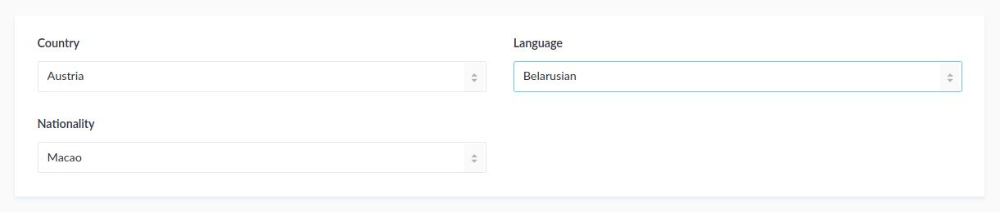

# strapi-plugin-international-fields

<a href="https://www.npmjs.org/package/strapi-plugin-international-fields">
    
</a>
<a href="https://www.npmjs.org/package/strapi-plugin-international-fields">
    
</a>

This plugin adds the following custom fields to your [Strapi](https://github.com/strapi/strapi) application:

* [Country](#country)
* [Language](#language)
* [Nationality](#nationality)

The option labels have localisation applied to if available. Check the [locales table](#locales) down below for the included Admin panel locales.



**Supported Strapi versions:**
 
* v3.6 (and higher)

_Older versions may work but are not tested._

## Installation

**Add plugin package**
```bash
# using yarn
yarn add strapi-plugin-international-fields

# using npm
npm install strapi-plugin-international-fields --save
```

**Rebuild Admin Panel**
```bash
# using yarn
yarn build --clean

# using npm
npm run build --clean
```

## Usage

Currently it isn't possible to add custom fields through the _Content-Types Builder_ with Strapi, so you'll need to add it manually. To add one of the custom fields to a content type you need to add it to the `attributes` field in the models settings file (`api/*/models/*.settings.json`) like the example below. 

```diff
{
  // ...
  "attributes": {
    "country": {
-      "type": "string",
+      "type": "country",
+      "columnType": "CHAR(2)"
    },
    "language": {
-      "type": "string",
+      "type": "language",
+      "columnType": "CHAR(2)"
    },
    "nationality": {
-      "type": "string",
+      "type": "nationality",
+      "columnType": "CHAR(2)"
    },
  }
}
```

## Fields

### Country
The country field provides an dropdown with every country from the [ISO 3166](https://en.wikipedia.org/wiki/ISO_3166) standard. The two-letter country code (ISO 3166-1 alpha-2) will be saved in the database. Almost all the Strapi Admin panel locales are included, so depending on the selected Interface language, the dropdown will be displayed with localized option labels.

### Language 
The language field provides an dropdown with every language from the [ISO 639](https://en.wikipedia.org/wiki/ISO_639) standard. The two-letter language code (ISO 639-1 alpha-2) will be saved in the database. Almost all the Strapi Admin panel locales are included, so depending on the selected Interface language, the dropdown will be displayed with localized option labels.

### Nationality 
The nationality field provides an dropdown with every nationality from the [ISO 3166](https://en.wikipedia.org/wiki/ISO_3166) standard. The two-letter country code (ISO 3166-1 alpha-2) will be saved in the database. Only English, German and French are included, so depending on the selected Interface language, the dropdown will be displayed with i18n options, with english as fallback.

## Locales
The following Strapi locales are supported per field. The default fallback is `en` (English).

| i18n locale | Native name          | Country | Language | Nationality |
|-------------|----------------------|:-------:|:--------:|:-----------:|
| ar          | العربية              | x       |          |             |
| cs          | Čeština              | x       | x        |             |
| de          | Deutsch              | x       | x        | x           |
| dk          | Dansk                | x       |          |             |
| en          | English              | x       | x        | x           |
| es          | Español              | x       | x        |             |
| fr          | Français             | x       | x        | x           |
| he          | עברית                 | x       |          |             |
| id          | Indonesian           | x       | x        |             |
| it          | Italiano             | x       | x        |             |
| ja          | 日本語                | x       | x        |             |
| ko          | 한국어                | x       |          |             |
| ms          | Melayu               | x       | x        |             |
| nl          | Nederlands           | x       | x        |             |
| no          | Norwegian            | x       | x        |             |
| pl          | Polski               | x       | x        |             |
| pt-BR       | Português (Brasil)   | pt      | pt       |             |
| pt          | Português (Portugal) | x       | x        |             |
| ru          | Русский              | x       | x        |             |
| sk          | Slovenčina           | x       |          |             |
| th          | ไทย                  | x       | x        |             |
| tr          | Türkçe               | x       |          |             |
| uk          | Українська           | x       |          |             |
| vi          | Tiếng Việt           | x       |  x       |             |
| zh-Hans     | 中文 (简体)           | zh      | zh       |             |
| zh          | 中文 (繁體)           | x       | x        |             |

### i18n packages
The following packages are used to display the localized option labels. 

* Country: [i18n-iso-countries](https://github.com/michaelwittig/node-i18n-iso-countries)
* Language: [@cospired/i18n-iso-languages](https://github.com/cospired/i18n-iso-languages)
* Nationality: [i18n-nationality](https://github.com/sourcecode911/i18n-nationality)

### Support
- [Strapi community on Discord](http://discord.strapi.io), feel free to DM me (@MattieBelt).
- [GitHub issues](https://github.com/MattieBelt/strapi-plugin-international-fields/issues) for bugs 🐛, contributions 🔧 or just anything to discuss 💬.

### Resources
- [Strapi website](http://strapi.io/)
- [Strapi forum](https://forum.strapi.io/)
- [Strapi news on Twitter](https://twitter.com/strapijs)

### License
- Copyright (c) 2020-2021 Mattias van den Belt & Strapi Solutions ([MIT License](LICENSE.md)).
